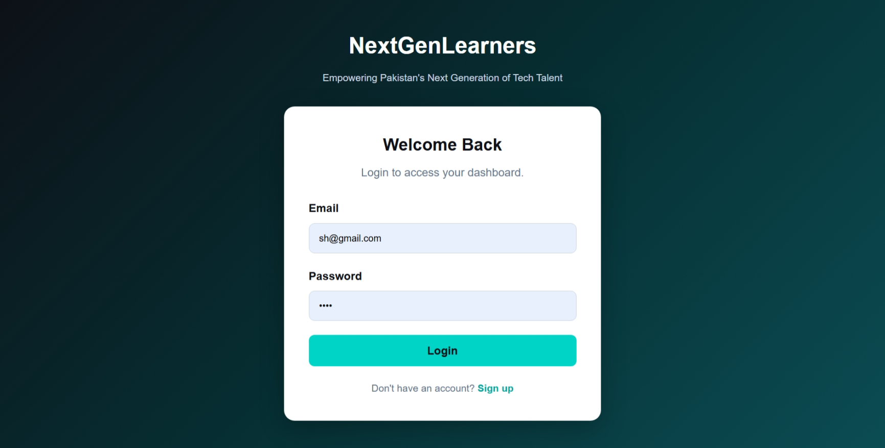
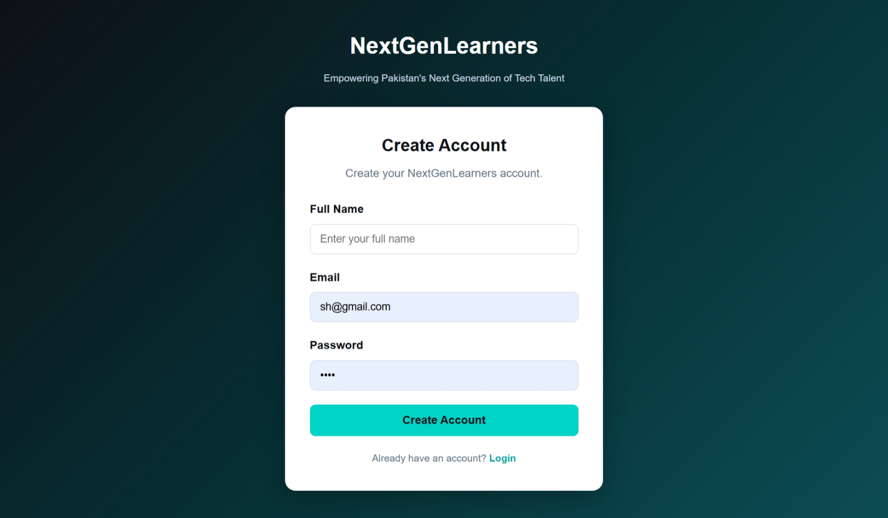
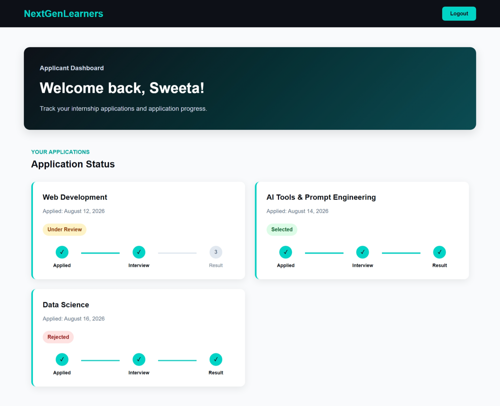
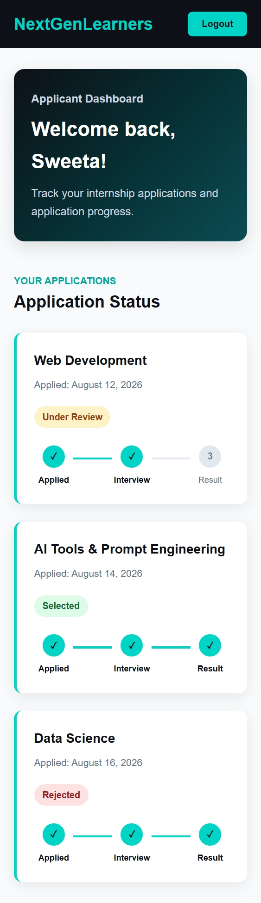

# NextGenLearners — Mini Applicant Dashboard

A frontend-only applicant dashboard that simulates a real internship portal experience.

This project allows users to sign up or log in, view a personalized dashboard, see their internship application status, and track their application progress.

The project uses `localStorage` to simulate authentication and user data without a backend.

---

## Features

- User Signup with Name, Email, and Password
- User Login with Email and Password
- Frontend-only authentication using `localStorage`
- Automatic redirect to the dashboard after successful login/signup
- Protected dashboard page
- Personalized welcome message using the logged-in user's name
- Applications list with:
  - Applied domain
  - Application date
  - Application status
- Status badges for:
  - Under Review
  - Selected
  - Rejected
- Application progress tracker:
  - Applied
  - Interview
  - Result
- Logout functionality
- Responsive design for desktop, tablet, and mobile
- Modular JavaScript structure
- Clean and consistent NextGenLearners color theme

---

## Tech Used

- HTML5
- CSS3
- JavaScript
- localStorage
- Responsive CSS
- CSS Flexbox
- CSS Grid

---

## Project Structure

```text
nextgen-week4-capstone/
│
├── login.html
├── dashboard.html
├── style.css
├── auth.js
├── dashboard.js
├── data.json
│
├── assets/
│   ├── images/
│   └── icons/
│
└── README.md
```
## Screenshots

The project was tested across different screen sizes to ensure a responsive user experience.

### Login Page



### Sign Up Page



### Dashboard — Desktop



### Dashboard — Mobile



## Clone This Project

Want to explore or run this project locally? You can clone the repository using Git.

## Clone This Project

Want to explore or run this project locally? You can clone the repository using Git.

### Clone the Repository

```bash
git clone https://github.com/Sweeta-w/next-gen-capstone.git
cd next-gen-capstone
```


### Even better — add a ⭐ line

Since it's a public GitHub project, you can add this at the end:

```markdown
## Support

If you found this project useful or helpful, consider giving the repository a ⭐ on GitHub!
```
